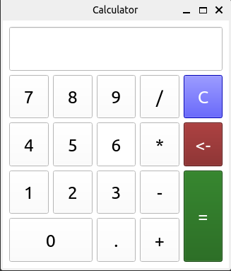

# Desktop-PyCalculator

<h3>:computer: Sobre o projeto</h3>

PyCalculator é uma aplicação desenvolvida em python para desktop com todas as funcionalidades convencionais(v1.7). Para construção do software foi usado o empacotador PyQt na versão 5.

Para mais informações sobre o PyQt5, clique [aqui](https://pypi.org/project/PyQt5/)

